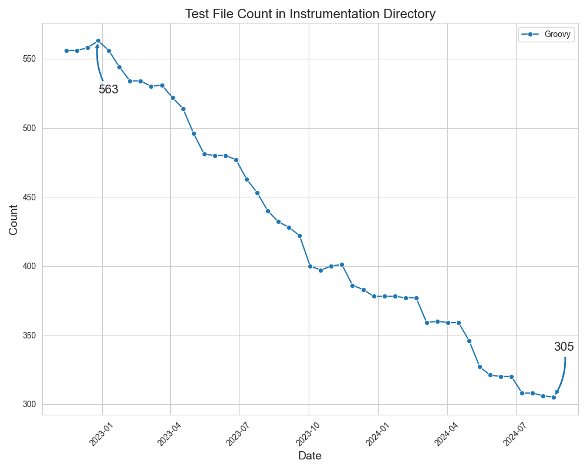
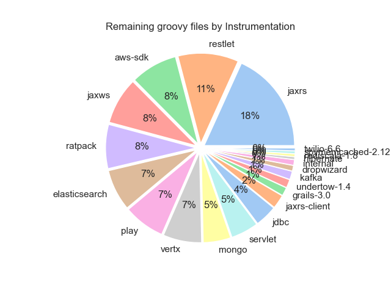

# Repo Metrics

Random collection of tools to pull and visualize various data about a repository as timeseries metrics.

Functionality:
* Timeseries file count tracking: for tracking migration projects from one language to another.
* Pull benchmark data and visualize as timeseries

## Setup

A github token is not required but it is recommended as you will get rate limited if you make too many unauthenticated calls

```
export GITHUB_TOKEN="insert-your-token"
make install
```

## Test / linting

```
# Make sure you install pytest and ruff
make install

# Tests
make test

# Linting
make lint
```


## File Count Tracking

### Arguments

| Argument   | Command         | Description                                                                | Example                                                    |
|------------|-----------------|----------------------------------------------------------------------------|------------------------------------------------------------|
| Repository | -r, --repo      | Repository name.                                                           | --repo "open-telemetry/opentelemetry-java-instrumentation" |
| Start Date | -s, --start     | Starting Date in format %Y-%m-%d (will calculate from this date until now) | --start "2022-11-15"                                       |
| Interval   | -i, --interval  | Interval (in days) between data points                                     | --interval 14                                              |
| Languages  | -l, --languages | Languages to count (in comma separated list)                               | --languages "java,groovy"                                  |
| Output     | -o, --output    | (Optional) Location where file should be saved                             | --output "./media/example.png"                             |

### Example Usage:

In the `open-telemetry/opentelemetry-java-instrumentation` repository, track the conversion of tests from groovy to java 
in the `instrumentation` directory starting from 2022-11-15 with a data point every 2 weeks.

`python main.py -r "open-telemetry/opentelemetry-java-instrumentation" -l "groovy,java" -s "2022-11-15" -i 14`

Output: 


Now just groovy

`python main.py -r "open-telemetry/opentelemetry-java-instrumentation" -l "groovy" -s "2022-11-15" -i 14`

Output: 




## Benchmark Visualization

This is very specific to the open-telemetry/opentelemetry-java-instrumentation repo

### Arguments

| Argument   | Command         | Description                                                                | Example                                                    |
|------------|-----------------|----------------------------------------------------------------------------|------------------------------------------------------------|
| Repository | -r, --repo      | Repository name.                                                           | --repo "open-telemetry/opentelemetry-java-instrumentation" |
| Start Date | -s, --start     | Starting Date in format %Y-%m-%d (will calculate from this date until now) | --start "2022-11-15"                                       |
| Interval   | -i, --interval  | Interval (in days) between data points                                     | --interval 14                                              |


### Example Usage:

Chart Min and max heap starting from 2022-02-14 with a data point every 30 days.

`python benchmark.py -r "open-telemetry/opentelemetry-java-instrumentation" -s "2022-02-14" -i 30`

Output:


## Detail Count by Instrumentation module

### Arguments

| Argument   | Command        | Description                                    | Example                                                    |
|------------|----------------|------------------------------------------------|------------------------------------------------------------|
| Repository | -r, --repo     | Repository name.                               | --repo "open-telemetry/opentelemetry-java-instrumentation" |
| Language   | -l, --language | Language to get count for                      | --language "groovy"                                        |
| Output     | -o, --output   | (Optional) Location where file should be saved | --output "./media/example.png"                             |

### Example Usage:

In the `open-telemetry/opentelemetry-java-instrumentation` repository, analyze the files in test directories in the 
`instrumentation` directory and outputting counts by module.

`python count_by_instrumentation.py -r "open-telemetry/opentelemetry-java-instrumentation" -l "groovy"`

Output: 

| Key               | Value |
|:------------------|------:|
| spring            |    52 |
| jaxrs             |    37 |
| servlet           |    23 |
| restlet           |    22 |
| couchbase         |    18 |
| aws-sdk           |    17 |
| ratpack           |    16 |
| elasticsearch     |    15 |
| play              |    15 |
| jaxws             |    15 |
| vertx             |    14 |
| mongo             |    10 |
| jdbc              |     8 |
| apache-dubbo-2.7  |     7 |
| jaxrs-client      |     5 |
| netty             |     5 |
| apache-httpclient |     3 |
| opentelemetry-api |     3 |
| grizzly-2.3       |     3 |
| grails-3.0        |     3 |
| undertow-1.4      |     3 |
| kafka             |     3 |
| internal          |     2 |
| dropwizard        |     2 |
| hibernate         |     1 |
| rediscala-1.8     |     1 |
| spymemcached-2.12 |     1 |
| twilio-6.6        |     1 |
| Total             |   305 |



## Approach

- Query Github for point in time snapshots based on commits around times spanning a timeframe
  - Get one data point every `interval` (example: every 14 days)
  - Filter based on some criteria
  - Cache this data locally to avoid repeated api calls
- Generate Graph to show results over time frame

