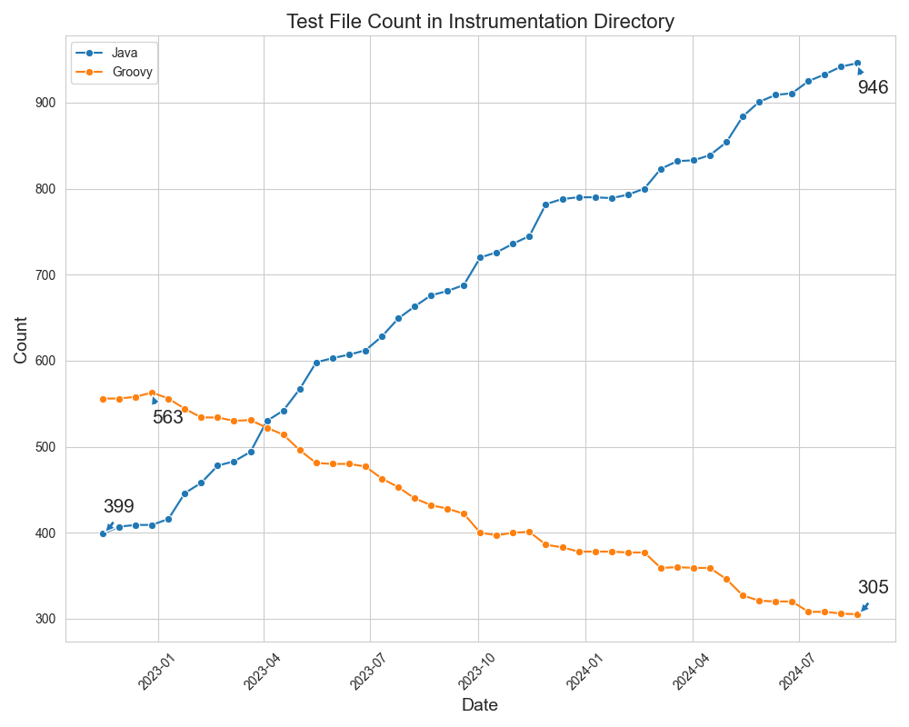

# Code Migration Tracker

Goal: Given a repository, a timeframe, and any filtering rules, track a goal over time.

## Setup

A github token is not required but it is recommended as you will get rate limited if you make too many unauthenticated calls

```
export GITHUB_TOKEN="insert-your-token"
pip install -r requirements.txt
python main.py
```

## Example:

In the `open-telemetry/opentelemetry-java-instrumentation` repository, track the conversion of tests from groovy to java 
in the `instrumentation` directory.

Output: 



## Approach

- Query Github for point in time snapshots based on commits around times spanning a timeframe
  - Cache this data locally to avoid repeated api calls
- Parse out counts of files that match criteria at each snapshot
- Generate Graph to show results over time frame